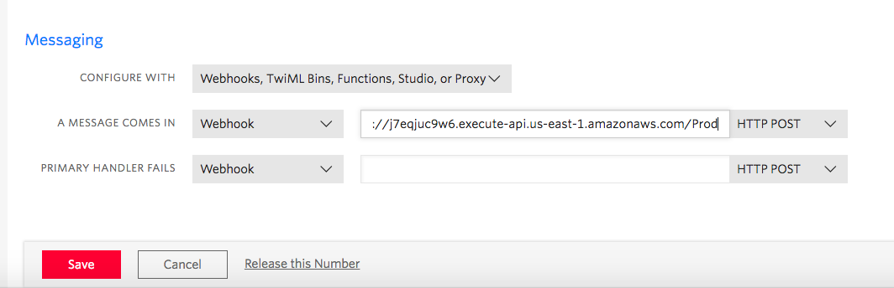

# Serverless Carrier Info

This project is for the Serverless Apps for Social Good Hackathon.

Law enforcement officers fighting human trafficing need an easy way to get a phone numbers caller ID and carrier info.

This Serverless App, with a Twilio integration, make that possible.

This function is triggered by a Twilio webhook (via API Gateway).  

SENT: 4101238765
RECEIVED: Caller Name: FINDLEY RANDOLPH
RECEIVED: Carrier Info: (mobile) T-Mobile USA, Inc.

## Twilio Account
First we need to create a Twilio account and get the `Account SID` and `Auth Token`

Create your Twillio account:
https://www.twilio.com/try-twilio

## Package and Deploy
Now it's time to create our Lambda function.

`npm run stack-up`

There is an output parameter called `ApiUrl` that you will need in the next step.  This will be your Twillio webhook url.

## Twillio Webhook Setup
Twilio needs to call our Lambda function every time it gets a message. 
- Click on the Products tab.
- Select the Programmable SMS box and hit Continue.
- Give your project a name.
- Invite teammates if you need to.
- Click the 'Get Started' button within the Programmable SMS box.
- Get a Twilio phone number.
- Navigate to your phone numbers:  https://www.twilio.com/console/phone-numbers/incoming
- Click on your number and scroll down to 'Messaging'
- Add your new `ApiUrl` from the previous step 'A message comes in' webhook.

